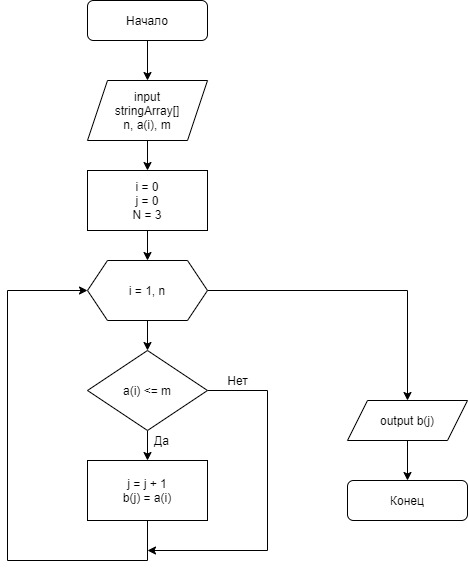

## __Final Control work__

#### Задача

1. Создать репозиторий на GitHub
2. Нарисовать блок-схему алгоритма (можно обойтись блок-схемой основной содержательной части, если вы выделяете её в отдельный метод)
3. Снабдить репозиторий оформленным текстовым описанием решения (файл README.md)
4. Написать программу, решающую поставленную задачу
5. Использовать контроль версий в работе над этим небольшим проектом (не должно быть так, что всё залито одним коммитом, как минимум этапы 2, 3, и 4 должны быть расположены в разных коммитах)

#### Описание алгоритма решения

По условию задачи создаём блок-схему алгоритма:

* Выбираем элементы удовлетворяющие условию
* Проверяем каждый элемент значения из массива на соответствие условию (Длинна <= 3)
* Выполняем подсчёт элементов и повторяем пока не достигнем конца исходного массива
* Возвращаем новый заполненный массив строки

По условиям задания, мы можем задать массив из строк вручную на старте выполнения алгоритма. Для реализации программы мы используем несколько методов:

1. Процедура Array - ввод данных в массив, по условию задания, длина которых не превышает 3 символа;
2. Функция Count - считает количество элементов массива с тремя и менее символами, длина которых удовлетворяет условию задания.
3. Метод PrintArray - позволяет вывести результат на экран.
