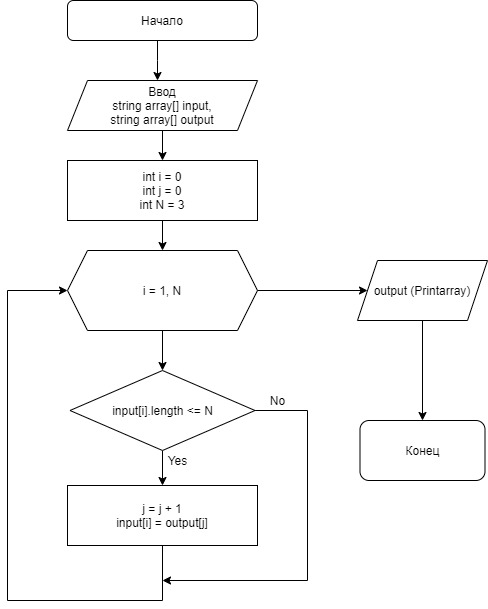

## __Final Control work__

#### Задача

Написать программу, которая из имеющегося массива строк формирует новый массив из строк, длина которых меньше, либо равна 3 символам. Первоначальный массив можно ввести с клавиатуры, либо задать на старте выполнения алгоритма. При решении не рекомендуется пользоваться коллекциями, лучше обойтись исключительно массивами.

#### Описание алгоритма решения

По условию задачи создаём блок-схему алгоритма:

* Выбираем элементы удовлетворяющие условию
* Проверяем каждый элемент значения из массива на соответствие условию (Длинна <= трём)
* Выполняем подсчёт элементов и повторяем пока не достигнем конца исходного массива
* Возвращаем новый заполненный массив строки

По условиям задания, мы можем задать массив из строк вручную на старте выполнения алгоритма. Для реализации программы мы используем несколько методов:

1. Метод ArrayCheck - он позволяет вычислить количество строк, по условию задания, длина которых не превышает 3 символа;
2. Метод FillResultArray - позволяет сформировать массив, состоящий из строк, длина которых удовлетворяет условию задания.
3. Метод PrintArray - позволяет вывести результат на экран.
